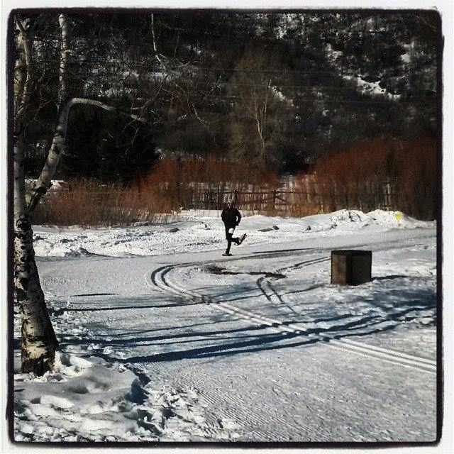

<!--more-->

Are you a multi-sport athlete who lives in or visits a cold winter
climate where running or cycling outside in snow or ice isn’t always the
safest or seemingly most enjoyable option? Have you tried snowshoe
running? Snowshoe running is a fast growing sport in the U.S. that
offers a low-impact alternative to the treachery of snowy and icy roads.
If you want to build strength and fitness during the winter months,
while getting outside, snowshoe running is an ideal option for runners,
cyclists, triathletes, and other endurance athletes to get off the
treadmill or trainer and get back outside. 

Interested yet? Here are a few basics on how to get started:

## Gear

**Get a pair of running snowshoes**. Running snowshoes differ from
trekking/hiking snowshoes in three ways. First, they have spring loaded
bindings. Your cadence and foot-plant are slowed down significantly when
running on a very soft surface like snow and this is exaggerated with
the added bulk of a snowshoe. Spring loaded bindings help provide a
quicker return when you push off the soft ground. Second, running
snowshoes have narrow waisted frames to help minimize the need to run
with a wider gait and promote a more natural stride. Thirdly, they are
constructed with lighter materials to lessen fatigue. Running in
snowshoes uphill, in powder, and at altitude will tire you out more than
any workout you’ve probably ever done and the lightweight materials of
running shoes do actually make a big difference.

**Don’t overdress**. The weather outside might be frightful, but running
in snowshoes kicks your internal thermostat into high gear. A rule of
thumb is if you feel comfortable and toasty before you start out, you
are overdressed. If you start your run a little cold, you are probably
perfectly prepared. In addition, choosing the right type clothing is as
important as the amount of clothing. When running in snowshoes,
especially through softer snow, most snowshoes kick up snow on your
backside. With your body temperature rising as you run longer, the snow
being kicked up on you will melt and surely turn you into a soggy mess.
That said, the best snowshoe running attire is lightweight, breathable,
water wicking, and flexible hardshell pants and jackets. Avoid anything
with pockets or hoods - you’ll be thankful after your run, because
pockets akin to those on the back of cycling jerseys and hoods will fill
up with flying snow from your stride. Other clothing you’ll need: ski
socks with a wool blend (wool+wet=warm), gaiters to keep snow from
getting into your shoe, weather protected running shoes to keep your
feet dry, and sunglasses to protect your eyes from the reflection off
the snow if it is sunny. 

## Where to go?

  
**Start at home**. Practice putting your snowshoes on and taking them
off at home. The last thing you want is to be in a cold trailhead
parking lot and not know how to step into the binding with your running
shoes and strap securely. Your entire run will be ruined with an
improperly secured snowshoe. Practice putting them on and taking them
off at home. You can also walk around on carpet or grass to get a feel
for what it is like to move with snowshoes.  
  
**Don’t go big at first**. Try something short, mellow and close to home
for your first time or first few times snowshoe running. Remember, this
is supposed to be fun and trying something extraordinary at first might
put a damper on your enthusiasm if you find it too difficult or
unenjoyable. On that topic, find a nice groomed trail or hard pack to
get the hang of running in showshoes. Most Nordic Centers allow
snowshoes, some parks and forest-service areas have areas that are
groomed, and the northeast is known for having well-maintained
snowmobile trails to run. You should also check out
http://snowshoes.com/ to find snowshoeing trails near your home or
vacation spot.  
  
**Go with others**. Organize a group snowshoe run with friends, find a
local running shoe store that is hosting group snowshoe runs, or hop in
a race. There is a wide selection of races, mostly 5K and 10K distance,
across the U.S. To locate a race near you, check out the following
resources:

United States Snowshoe Association: <https://www.ussnowshoe.com/> 

Atlas Beaver Creek Snowshoe Race Series:
<https://www.vaildaily.com/entertainment/calendar/#!/details/BEAVER-CREEK-SNOWSHOE-SERIES/11336733/2023-01-22T10>  
  
Dion Snowshoe Series in the Northeast:
<http://runwmac.com/snowshoes/default.html> 

