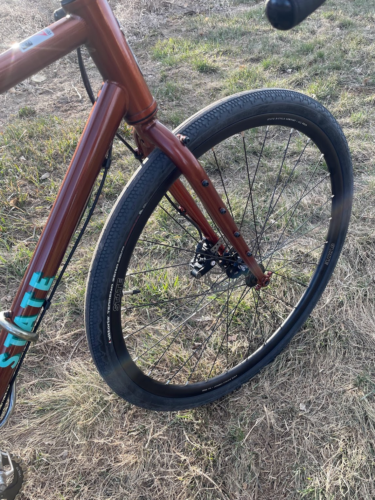
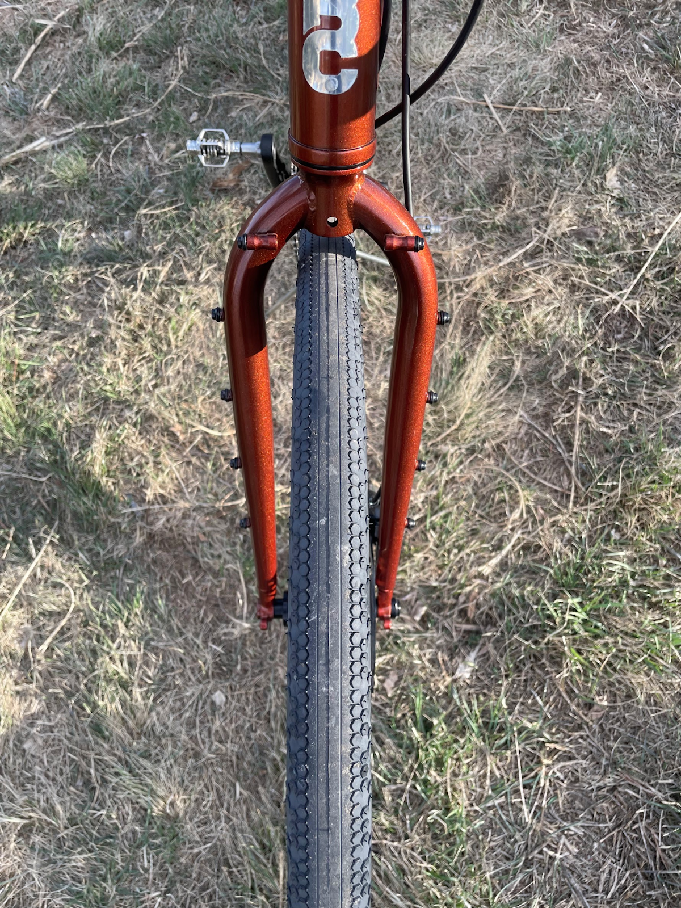
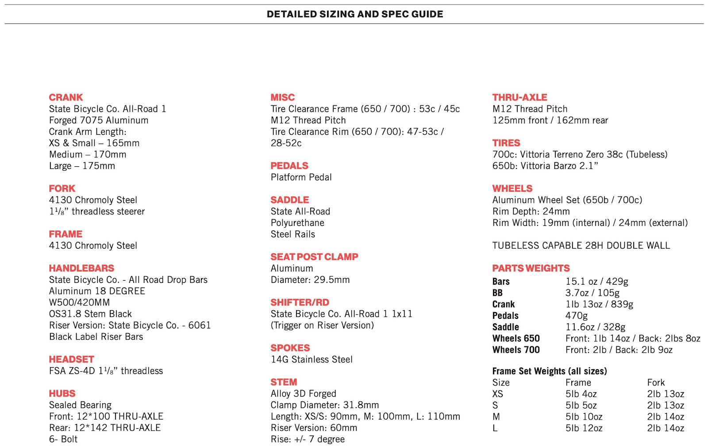

<!--more-->

[State Bicycle 4130 All-Road 700c Gravel
Bike](https://www.statebicycle.com/collections/bicycles/products/4130-all-road-copper-brown-650b-700c)
($899)

I received a loaner [State 4130 All-Road - a drop-bar steel gravel bike
that costs just
$900](https://www.statebicycle.com/collections/bicycles/products/4130-all-road-copper-brown-650b-700c).
It has clearance for big tires, lots of mounting options, and your
choice of 650b or 700c wheels. I was curious how such an affordable bike
would hold up in the real world, so I have been testing a 700c version
for the last few weeks. Overall, I have been impressed with the 4130
All-Road. It's a well-built bike that rides great on a variety of
surfaces. The steel frame is comfortable and absorbs bumps well, and the
gearing is wide enough to handle both climbs and flats. The brakes are
also powerful and reliable.

Weather permitting, I have taken the State 4130 All-Road on everything
from gravel road to bike path to singletrack trails, and it's handled
everything I’ve thrown at it with relative ease. It is a great
entry-level gravel bike that offers good value for the price. The bike
is made from a durable steel frame and fork, and it comes with a wide
range of gears that make it easy to tackle hills and rough terrain. It
also has clearance for wider tires, which allows for customizability and
makes it more comfortable to ride on rough roads. However, there are a
few drawbacks to the All-Road. It's not as light as some other gravel
bikes, and it doesn't have as many features, such as a dropper post. It
also doesn't come with any accessories, such as fenders or a rack.

> ### **Pros**
>
> - Affordable price
>
> - Durable steel frame and fork
>
> - Wide range of options for gearing
>
> - Clearance for wider tires
>
> - Bikepacking ready
>
> - Comfortable riding and fit

> ### **Cons**
>
> - Heavy
>
> - With the affordable price point, I don’t know the relative
>   durability
>
> - Doesn't come with any accessories

### **Bike and Kit**

This won’t surprise anyone: cycling is an expensive sport where gear and
bikes can cost a fortune for most. Even entry-level bikes suitable for
gravel riding and bikepacking can cost over $2,000. However, there are a
few affordable options available, such as the Salsa Journeyman, the
Poseidon Redwood, and the State Bicycle Company 4130 All-Road. These
bikes are built with affordable components but still have features that
are important for bikepackers and gravel riders, such as clearance for
wide tires and mounting points for racks and bags. While these bikes may
not be as high-end as some of the more expensive options, they are still
a great way to get into riding and even bikepacking.

The 4130 All-Road components are well-suited for its price range. The
Vittoria Terreno Zero 38c (Tubeless) tires and All-Road wheels are a
good choice for mixed terrain riding, and the 700 x 38mm build provides
a good balance of speed and comfort. The All-Road handlebar has a
comfortable 18° flare and shallow drop, which makes it good for both on-
and off-road riding. However, the stock bar tape is quite thin and does
not cover enough of the bar to provide much comfort. Overall, the
components are a good starting point, but some riders may want to
upgrade the bar tape and stem to suit their individual needs.

State offers a complete 1x11 drivetrain for its All-Road bike. The kit
includes a 1x crank in your choice of 165, 170, or 175mm lengths with a
42t narrow-wide chainring, which is compatible with standard 110 BCD
cranks. State also sells its All-Road 1 chainrings in 38, 40, 42, and
44t. The drivetrain functioned smoothly, but the 42t front chainring and
11-42t cassette may be too much of a push for those who live in hilly
areas. The bike's 26 lb weight can also make climbing hills slower. The
rear derailleur struggled to stay in position at times, which made me
nervous when shifting quickly under load on uphills. It could have been
due to my slipshod adjustment prior to the ride, because it didn’t
really happen again, but I was also really careful to shift only when
necessary and at the best time during my pedal stroke.

The 4130 steel frame is offered in several colors, and includes a
matching steel fork. Both the frame and fork have clearance for 700c x
45mm or 650b x 50mm tires, which makes the All-Road a versatile bike
that can be used for a variety of purposes, including bikepacking. The
frame also has a number of braze-ons, which can be used to mount racks,
fenders, bottle cages, and cargo options. This makes the All-Road a
great choice for riders who want a bike that can be customized to fit
their needs. The cable routing is kept simple with full external routing
guided through bolt-on clamps along the downtube. This makes it easy to
maintain the bike and makes it less likely that the cables will get
tangled. For long haul security, the frame and fork both include 12mm
thru axles and flat mount brakes. This makes the All-Road a capable bike
for long rides and adventures.

### **Fit and Ride**

One of the things I like most about the 4130 All-Road is its comfortable
riding position. The bike has a relatively upright geometry, which makes
it easy to see what's going on around you. The handlebars are also wide
and swept back, which provides a comfortable grip. This makes it a great
choice for long rides, as you won't get as tired as you would on a bike
with a more aggressive riding position. It is comfortable and offers a
stable ride. Despite being a steel frame, the bike is reasonably light,
making it easy to maneuver. And the steel provides some dampening
compliance on bumpy roads and trails. The bike has a relatively long
wheelbase, which also makes it stable at higher speeds. 

Another thing I like about the 4130 All-Road is its versatility. The
bike can be used for a variety of purposes, including commuting,
touring, and even light off-road riding. The bike comes with a wide
range of gears, which makes it easy to tackle hills and rough terrain.
It also has clearance for wider tires, which makes it more comfortable
to ride on rough roads. This makes it a great choice for riders who want
a bike that can do it all.

Overall, the 4130 All-Road is a great choice for riders who are looking
for a comfortable, versatile, and capable bike. It's perfect for
everyday riding, as well as longer adventures.

> 

### **Conclusion**

Ultimately, the best bike for gravel riding and/or bikepacking is the
one that fits your budget and needs. If you're on a tight budget, the
All-Road would be a great option. If you have a little more money to
spend, you could also consider a higher-end bike with more features.
Needless to say, the State Bicycle Company 4130 All-Road is a great
choice for riders who are looking for an affordable, durable, versatile,
and comfortable gravel bike. It's a great all-around bike that can
handle a variety of terrain.

- **Affordability.** It is one of the most affordable gravel bikes on
  the market. It's priced significantly lower than other bikes with
  similar features and components.

- **Durability of Steel.** The 4130 All-Road is made from a durable
  steel frame and fork. This makes it a great choice for riders who are
  looking for a bike that can withstand and enjoy the rigors of off-road
  riding.

- **Versatility.** The 4130 All-Road is a versatile bike that can be
  used for a variety of purposes, including commuting, touring, and even
  light off-road riding.

- **Comfort.** The 4130 All-Road is a comfortable bike to ride. It has a
  relatively upright geometry, terrain dampening steel frame, and a wide
  range of gears, which makes it easy to tackle hills and rough terrain.

- **Style.** The 4130 All-Road is a stylish bike that is sure to turn
  heads. It comes in a variety of colors and styles to choose from.

**Ride - 8/10** (surprisingly light feeling even though it is steel,
stable, and compliant on the bumpy stuff)  
**Fit - 8.5/10** (I made only minor adjustments after finding the right
saddle height)  
**Specs - 7.5/10** (decent house brand components, which is a bonus to
keep the price down)  
**Fun Factor (out of 5)** - 🙌 🙌 🙌 🙌   
**Overall Average: 8 / 10**

Thanks for reading Boulder Gear Lab! Subscribe for free to receive new
posts and support my work.
