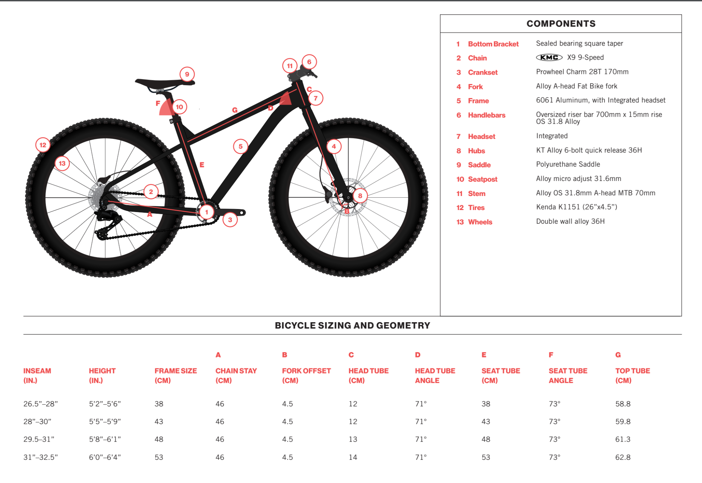

<!--more-->

*Article by John Tribbia*

### State Bicycle Co. 6061 Trail+ Fat Bike ($999)

XS
5’1” to 5’6”	

S 
5’5” to 5’10” 	

M
5’9” to 6’2” 	

L
6’1” to 6’5”

### Introduction

Living near Boulder, Colorado means I'm practically tripping over amazing trails every time I step outside. Naturally, fat biking during the shoulder and snow season is always on my radar – the idea of conquering snow-covered paths and expanding the riding season is incredibly appealing. I've been following . for a while now, appreciating their commitment to accessible quality, so I jumped at the chance to test out the . I was curious to see how their value-driven philosophy translated into the world of fat bikes, especially here in the varied terrain of the Colorado Front Range.

For those unfamiliar, State Bicycle Co. was established back in 2009 in Tempe, Arizona, with a clear mission: to offer affordable, high-quality bikes to a wider audience. And at a price point of $999.99, the 6061 Trail+ certainly aims to deliver on that promise.
This review will focus on my experience with the "Wildberry" colorway – a striking finish, let me tell you. I'll be diving into its riding characteristics, component highlights (and a few drawbacks), and ultimately, whether it represents a solid value for aspiring fat bikers.

### Pros:

Affordable: Fat bikes can often break the bank. The 6061 Trail+ offers a surprisingly affordable entry point into a niche that's often intimidatingly expensive. Big points for accessibility!
Colorway: I’ll be honest, aesthetics matter. The Wildberry colorway is seriously eye-catching and adds a touch of individuality to the bike. It gets you excited to ride, and that's half the battle.
Stable Ride: The combination of the beefy 26" x 4.5" Kenda Juggernaut tires and the bike's overall weight creates a very planted feel on the trail. This is particularly confidence-inspiring for newer riders still getting used to the feel of a fat bike.
Reliable: The Shimano Altus 9-speed drivetrain may not be the flashiest, but it's a reliable workhorse that gets the job done. I encountered no major issues, even when tackling muddy or snowy conditions.
More Than Just Snow: The 6061 Trail+ is surprisingly versatile for urban commuting, gravel paths, and general recreational riding, making it a usable option year-round.

### Cons:

Weight: Let's be blunt: this bike isn't light and most of the weight is in the wheels. At 40 lbs (18 kg), you'll definitely feel it on longer rides, especially when the trail points uphill.
Gear Range Limitations: The 11-36 tooth cassette paired with the 28-tooth chainring might leave you wanting more on steeper singletrack climbs. A wider gear range would definitely be beneficial.
Not Tubeless: The wheelset isn't tubeless-ready out of the box, which is a missed opportunity. Going tubeless would improve ride quality and reduce the likelihood of pinch flats.

### First Impressions

Unboxing the 6061 Trail+ was exciting. Those massive Kenda Juggernauts are immediately impressive, and the Wildberry colorway pops. I did notice the heft of the wheelset, and the stock 28-tooth front chainring seemed a bit small for the local trails. My initial impression of the Tektro mechanical brakes was one of mild concern, but they proved to be surprisingly capable after a proper bedding-in and adjustment. The first thing I did was swap out the plastic pedals for some metal hand-me-downs – a worthwhile upgrade for any bike, in my opinion.

### On the Trail

My first ride was on a mix of local trails, ranging from smooth gravel paths to more technical singletrack with short, steep climbs.
Uphill: The weight of the bike became very apparent on the steeper inclines. Maintaining momentum required effort. While the 28T chainring helped to some extent, the Altus drivetrain didn't feel quite as smooth or responsive under load compared to the SRAM Eagle NX 1 x 12 setup .

Downhill: Once I hit the flowy downhill sections, the 6061 Trail+ really shined. The weight and wide tires created a planted and confident feel, inspiring me to lean into corners and let the bike do its thing. This held true on both dry dirt and snow-covered trails. The Tektro mechanical brakes provided adequate stopping power, on par with my experience with the  (Review).
Snow Performance: We’ve had decent snow this winter in the Boulder area, so testing this bike in the snow was a must! The 6061 Trail+ performed admirably in fresh powder. The wide tires provided excellent flotation, allowing me to climb snowy hills with surprising ease. The Altus 9-speed drivetrain continued to function reliably, even in muddy and slushy conditions.

### Fit and Comfort:

Being 5'6" with a shorter torso, I found the stock fit of the 6061 Trail+ to be comfortable and easily customizable. As in some other reviews I've read, I did find the seatpost to be quite short (see above photo). As with the State 4130 All-Road, I believe that upgrading the bars and stem could also further improve both comfort and handling. The frame dimensions felt relatively compact, contributing to a sense of agility in tighter sections and making the bike easier to maneuver overall.

### Conclusion and Rating

The State Bicycle Co. 6061 Trail+ is a compelling entry-level fat bike that provides excellent value for riders curious about exploring the world of fat biking. While it does have some limitations, such as its weight and slightly dated geometry, its affordability, reliability, and striking aesthetics make it a worthwhile option to consider. The Shimano Altus drivetrain is a dependable performer, and the wide tires offer plenty of stability and traction. This bike is ideally suited for recreational riding, urban commuting, exploring gravel paths, and tackling milder trails.

### Ride: 7.5/10 (Stable and planted downhill, but heavier on the climbs)

Fit: 9/10 (Adequate fit for my size and the price point, but would consider upgrading contact points for optimal comfort)

### Specs: 8.5/10 (Great value for the money: reliable components at an accessible price)

### Fun Factor: 🙌 🙌 🙌 🙌

### Overall Average: 8.3/10
