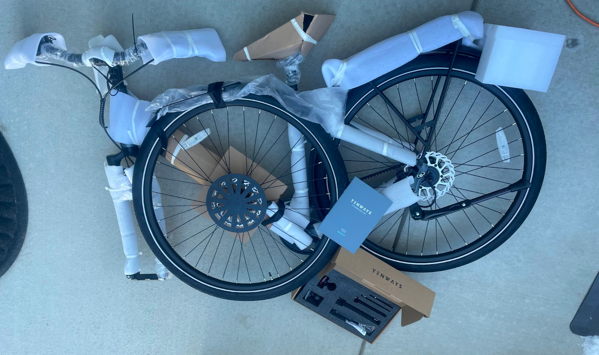
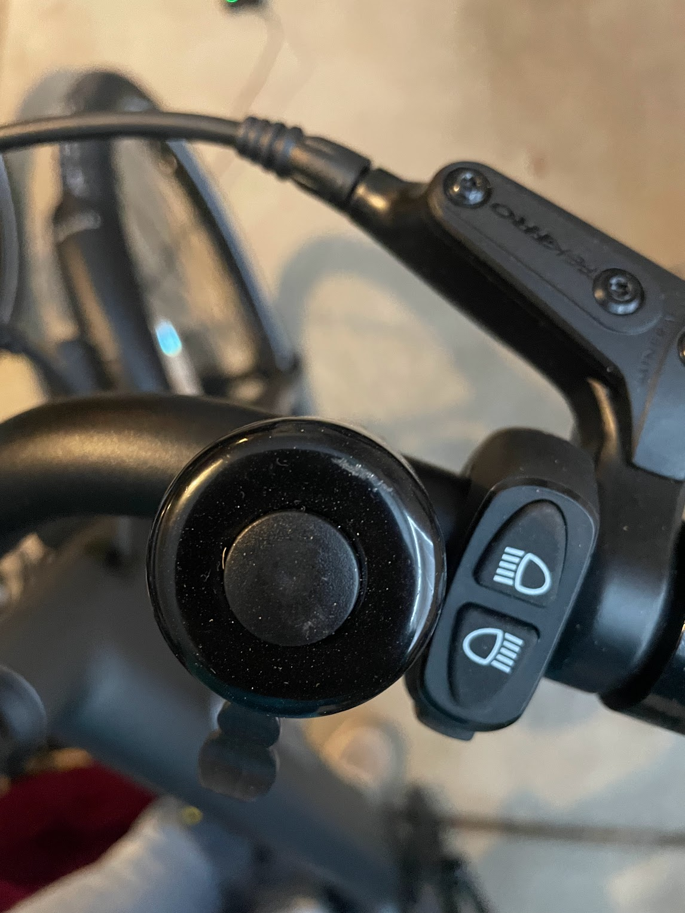
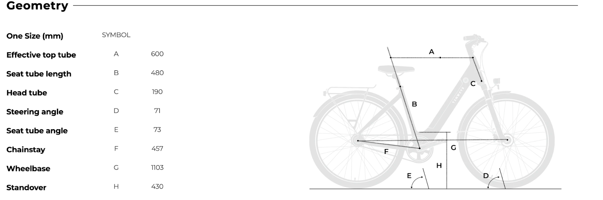
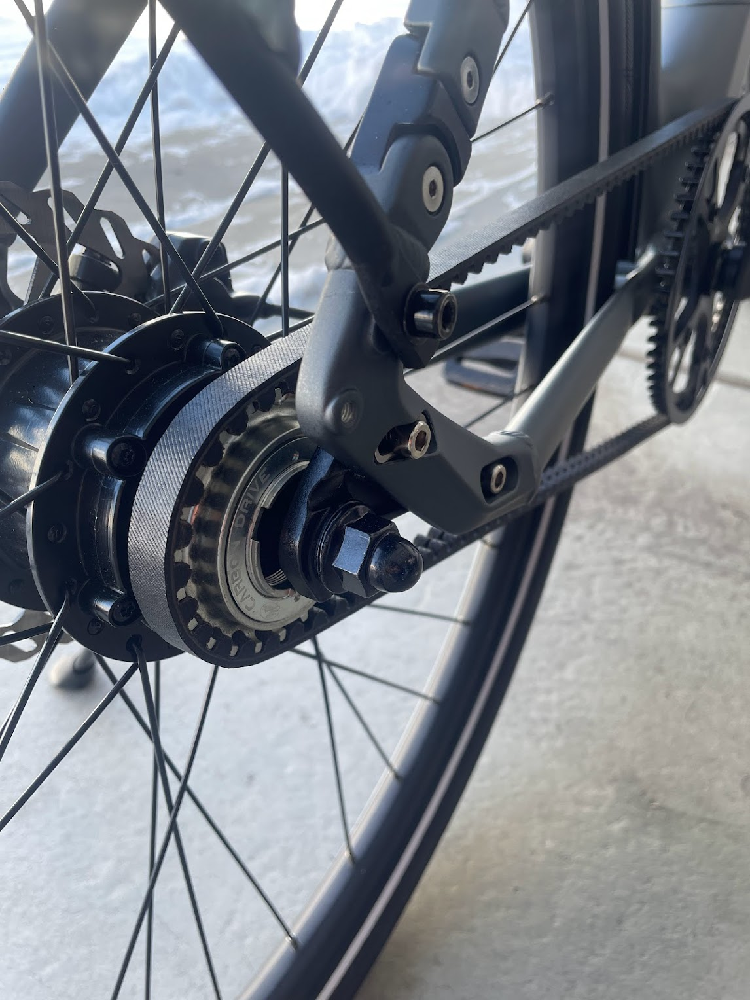
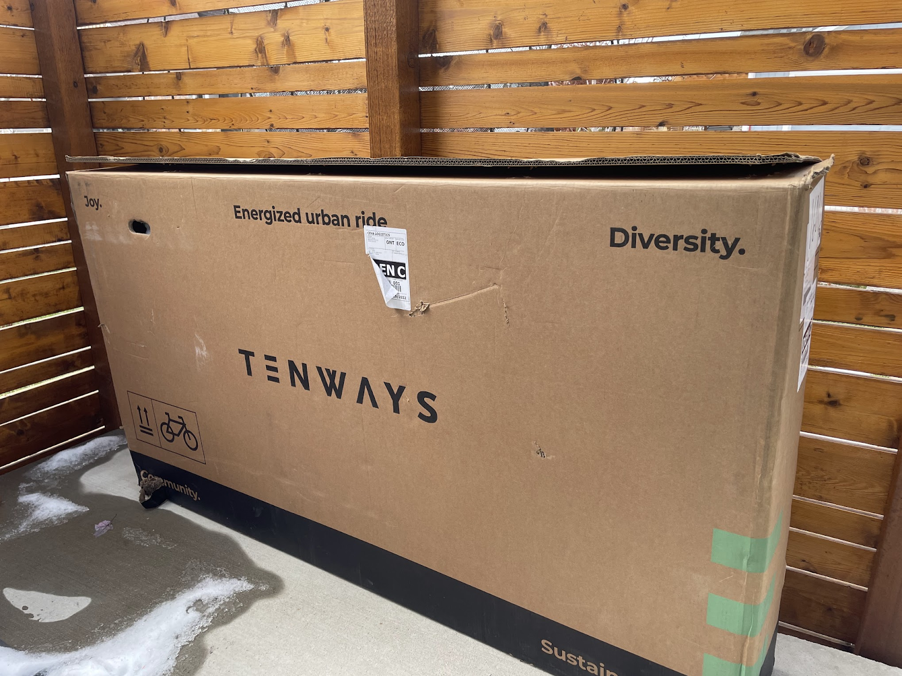
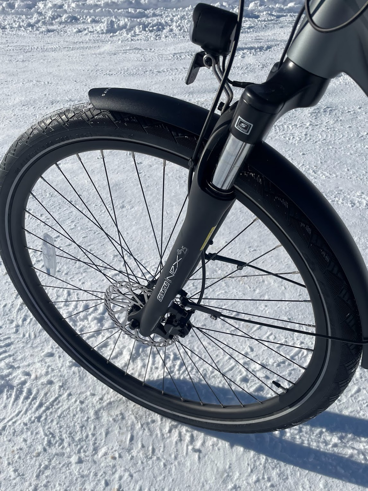

<!--more-->

Review also available on RoadTrailRun
([link](https://www.roadtrailrun.com/2022/12/tenways-cgo800s-ebike-review.html))

<a href="https://www.roadtrailrun.com"
class="button primary button-wrapper">Read All RoadTrailRun
Reviews Here</a>

TENWAYS CGO800S eBike Review ($1,999)

### Introduction

[TENWAYS
Bicycles](https://www.tenways.com/?ref=johntribbia&utm_source=tapfiliate&utm_medium=affiliate&utm_campaign=johntribbia)
is headquartered in the Netherlands, which is basically the cycling
capital of the world where bikes are a cultural symbol for the Dutch.
The company is in its early years, assembled as a group of cycle
enthusiasts and experts in the bike trade who are obsessed with building
a greener and more sustainable world together. After an incredibly
successful 2021 crowdfunding campaign, the first TENWAYS eBike started
to find its way to city streets. Since then, TENWAYS has grown to
welcome a diverse and global family of riders, creators, and
enthusiasts. TENWAYS is on a mission to make commuting effortless,
speedy and fun, so that we can all love the way we ride. 

Beyond putting smiles on bike buyers’ faces, what I love about TENWAYS
is their enviro-social mission to reduce their carbon footprint and make
riding bikes accessible to marginalized groups. The company is working
towards zero-emissions production and they currently control their waste
emissions to the highest applicable standards and work to offset their
carbon footprint by supporting selected non-profit organizations.
Moreover, TENWAYS is helping mitigate climate change in cooperation with
[Just One Tree](https://www.justonetree.life/) by planting a tree on the
buyer’s behalf for every e-bike delivered. Lastly, TENWAYS donates bikes
to those who simply can’t afford reliable mobility together with
[Wheels4Life](https://wheels4life.org/). 

TENWAYS sent me their new [CGO800S model
eBike](https://www.tenways.com/products/cgo800s/?ref=johntribbia&utm_source=tapfiliate&utm_medium=affiliate&utm_campaign=johntribbia).
It’s a simple single speed eBike that, according to TENWAYS “modern
commuting meets classic comfort”. Think of the streets of Amsterdam with
cyclists on upright bikes riding around town, but with an electrified
and modernized upgrade. That’s why the CGO800S is the go-to bike for
regular commuters, where geometrically designed comfort meets
outstanding, technologically advanced performance. This is a great
option for those needing a car-less way to get to work, to a track
workout, the gym, or the grocery store. 

**Pros**

- Incredibly smooth torque sensing power delivery

- Comfortable riding position and versatile for various sized people

- Relatively good range for single speed

- Lights, rear rack, strong kick-stand, and fenders all come included

- Top loading battery

- $1,900 pricepoint is a nice entry point to eBikes

**Cons**

- Lower battery range in terrain that isn’t flat

- Single speed setup is best suited for regular and long distance riding
  on flat terrain

### First Impressions

Like the [Priority Continuum
Current](https://www.roadtrailrun.com/2022/09/roadtrailride-priority-current-ebike.html)
I reviewed a couple of months ago, the CGO800S arrives packed in a bike
box. It is a heavy box that may require two people to carry. 

Most direct to consumer eBikes (especially those with carbon belt drives
with little to no adjustment needs), like the CGO800S, are basically 90%
assembled. TENWAYS provides all of the necessary tools to assemble as
well as helpful instructions on how to do it. I received a beautiful
pebble gray colorway frame. The rear fender is already installed along
with integrated front and rear rear lights. The bike also comes equipped
with a sturdy kickstand and an adjustable stem that is easily adjusted
up or down for more comfortable positioning. 

The CGO800S is a single speed set up with a carbon belt drive. The bike
is pedal assist and does not come with a throttle. There’s a smart LCD
display that is positioned in the middle handlebar stem with easy to
find and use control buttons on each side. The left buttons allow you to
select through the menu and the assist level. The right switches are for
the integrated headlight, taillight, and turn indicators. There’s also a
TENWAYS companion app that allows you to pair your smartphone via
Bluetooth to the bike which enables navigation, destination selection by
pressing on the map, and other functions like recording ride duration,
distance, moving time, average speed.

Tail Light has turn signal indicators that are intuitively controlled by
the buttons near the right grip (photo below)

Once the bike was built, I took the CGO800S for a ride around the
neighborhood. U.S. sold bikes have a maximum assist speed at 20 mph (32
km/h). The Mivice M070 250W Rear Hub Motor is a relatively small motor,
but delivers a smooth and reasonably strong pedal assistance that really
starts to kick in when you put in a few hard pedal strokes thanks to the
magnetic torque sensor. If you turn off the power, you’ll notice how
much assistance is being provided despite the smaller motor size.

Compared to other geared eBikes, the single speed CGO800S feels and
rides as well  or better than other carbon belt geared eBikes. I love
how quiet it is while pedaling because of the single speed belt drive.
The bike features super smooth and torque sensing power, which means all
you have to do is turn on the bike, select one of five power levels, and
ride away. With Level 5, the assistance makes your pedaling power
exponentially increase and top speed is easy to achieve. It is really
nice on steep uphills, which for me was comfortable up to about a 15%
incline. The 250W hub motor is stealthy, silent, and smooth emitting no
more than a slight hum even at the max power output. Moreover, the
drivetrain is durable, reliable, and secure since there’s no chance of
any chain dropping. TENWAYS claims the belt drivetrain provides over 18K
miles of maintenance and adjustment free riding. It’s virtually
weatherproof and I’m a big fan..

The brushless hub motor with carbon belt is durable, low maintenance,
and is incredibly quiet.

### Ride

I started riding the CGO800S on commutes to/from work and neighborhood
tours. My commute to work is around 8 miles and mostly flat. Around the
neighborhood, I was able to ride on a few short but steeper hills of
10-15% incline. I took the bike on dry pavement and hard gravel paths.
The belt drive, torque sensing motor, rider positioning, suspension
front fork, and hydraulic brakes are the highlights for me. 

Simple integrated LCD display that is easy to see and control when
riding

I found that the bike does well on flats, but requires added assist and
more effort on steeper uphills. With the 250W and torque sensor, the
TENWAYS CGO800S can handle the relatively mellow hills easily, but I had
to get out of the saddle a few times on the steeper hills. Compared to
the 500W mid-drive torque sensing motor on the Priority Current, the
250W motor on the TENWAYS is noticeably less powerful. But it  is also
40% less expensive than the Current and I would say the use-cases are
much different as the CGO800S is ideal for the easy cruise/commute to
work while the Current is could be used for more extreme topography.

It is really easy to [set up the TENWAYS CGO800S on their
app](https://www.tenways.com/blogs/our-e_bikes/how-to-connect-my-e-bike-with-the-tenways-app)

According to TENWAYS, as a Class 1 eBike, CGO800S riders will get up to
60+ miles per battery charge. This can vary based on assistance level,
weight of rider and gear, speed, elevation, temperature, tire pressure,
head wind and terrain. During my 16 mile round trip commutes, I used the
mostly 4 pedal assist and arrived home with around 75% of the charge
remaining.

The 36V, 10.4Ah Lithium-ion Battery with 18650 cells is integrated into
the top of the downtube and I found it really easy to remove and
reinsert. I personally like the battery to be on the upper part of the
downtube as opposed to the bottom. You can also charge while the battery
is still in the bike, since the insert is exposed with a rubber flap
cover. 

The TENWAYS CGO800s makes riding or commuting really simple and
incredibly fun! Overall, the bike riding is smooth, quiet, and the pedal
assist is between touchy and moderate from a standstill (which is just
enough for a single speed). It is a heavy bike, when including the
battery, but at 50+ pounds it isn’t outside the normal range for an
eBike. Although the weight quite noticeable if you don’t use any pedal
assist, the relatively powerful motor and graded assist is more than
enough to counter the weight of the bike.

Sturdy kickstand, disc brakes, and all purpose tires are great features
of the CGO800S

The tires are CST Puncture-proof in size 700\*48C. They rolled
efficiently on tarmac and did well in wet and dry conditions. 

I really appreciate the SR SUNTOUR Suspension Front Fork that does an
excellent job of muting road bumps especially at higher speeds. 

The CGO800S is a really fun and easy to use bike. I find myself wanting
to take it on quick trips to the store and for casual neighborhood
rides. The bike comes equipped to counter adverse weather conditions
with the carbon belt drive, hydraulic disc brakes that are easy to
squeeze with cold hands or with mittens on, fenders, and a rear rack. 

**Fit**

The CGO800S comes in only one size, but is designed to fit riders
between 5'1'' - 6'3''. I’m 5’6” and the relaxed frame geometry and reach
were suitable for my shorter inseam and arm length without any
adjustment out of the box. The positioning is upright and can be easily
modified with the adjustment of the stem.

I found the Selle Royal saddle is well cushioned and comfortable for
casual cruising and is ergonomic for faster pedaling cadences

### Specs

### Conclusions & Rating

At $1,999, the [TENWAYS
CGO800S](https://www.tenways.com/products/cgo800s/?ref=johntribbia&utm_source=tapfiliate&utm_medium=affiliate&utm_campaign=johntribbia)
is a reasonable price for this range of eBikes. The greatest appeal of
the TENWAYS is its simple design, durability, and the incredibly low
maintenance it requires. The CGO800S is a bike that can withstand the
weather with long lasting and easy to maintain parts such as the Gates
carbon belt drive, hydraulic disk brakes, fenders, and automatic lights.

The CGO800S is versatile and with front suspension it is an excellent
option for roads, bike paths, and crushed gravel paths. While only a
single speed gearing, the bike is peppy enough to keep pace with stop
and go traffic with a top speed of 20mph for U.S. bikes (16mph for
European bikes). As a frequent commuter, I love the rear rack and
appreciate the fenders for wet riding conditions. Even with the 250W
battery, the range on the bike is quite good compared to other similarly
classed eBikes.

Ride - 9/10 (Smooth, quiet, and easy)  
Fit - 8/10 (even with one size fits many, it is reasonably versatile and
comfortable)  
Specs - 8/10 (at the price point, it is a great bike that can take you
from A to B)  
Fun Factor (out of 5) - 🙌 🙌 🙌 🙌  

Overall Average: 8.33 / 10

### Comparisons

**Priority Current** ([RTR
Review](https://www.roadtrailrun.com/2022/09/roadtrailride-priority-current-ebike.html)) 

Both the Priority Current and the TENWAYS CGO800S eBikes come equipped
with carbon belt drives, torque sensing motors that are great for
acceleration, are easy to maintain and durable, and come direct to
consumers with an easy at-home assembly. The Current is incredibly
performant - enabling riders to adjust pedaling resistance with rear hub
shifting and providing the option to govern the maximum speed with easy
adjustment to Class 3 from Class 1 for more power + speed. The Priority
is better suited for varied terrain and the TENWAYS is best on the
flats. That said, the CGO800S has a much more smooth torque sensor that
allows for a less jerky acceleration. Moreover, the TENWAYS is 2/3rds
the price of the Priority, has better battery life and range, has a more
comfortable saddle that is better for longer distance riding, and is
more tech user friendly with an accompanying app and slightly more
intuitive controls. 

### Tester Profile

**John Tribbia** is a regular technical reviewer for running-oriented
product testing website [RoadTrailRun](http://www.roadtrailrun.com) with
a large readership domestically and internationally. He has other
writing about NAAW
[Sunscreen](https://naawkblog.wordpress.com/2017/01/03/dont-stow-away-the-sunscreen/),
Thule [Jogging
Strollers](http://www.backcountry.com/explore/dos-and-donts-of-baby-jogging),
Atlas [Snowshoe
Running](http://www.backcountry.com/explore/winter-fitness-snowshoe-running),
and Yuba Cargo E-Bike ([Part
I](https://yubabikes.com/how-to-adopt-the-cargo-bike-lifestyle-step-1/),
[Part
II](https://yubabikes.com/how-to-adopt-the-cargo-bike-lifestyle-step-2/),
[Part
III](https://yubabikes.com/how-to-adopt-the-cargo-bike-lifestyle-step-3/),
[Part
IV](https://yubabikes.com/how-to-adopt-the-cargo-bike-lifestyle-step-4/)). 

He dabbled in bike racing both mountain and road as a junior Cat 5 and
eventually upgraded to Expert on the mountain bike. After his brief
stint of cycling racing and once in college, John crossed over to
running and found success as a sponsored mountain/trail runner by
placing atop the podium in domestic and international races. But he
always kept his bikes nearby for cross training while injured,
supplemental training, and commuting. Given that cross-over experience
as well as 6+ years of working at [University
Bikes](https://www.ubikes.com/) in Boulder, CO and over 20 years of
competitive running, he loves the opportunity to test the latest and
greatest in both sports. 
