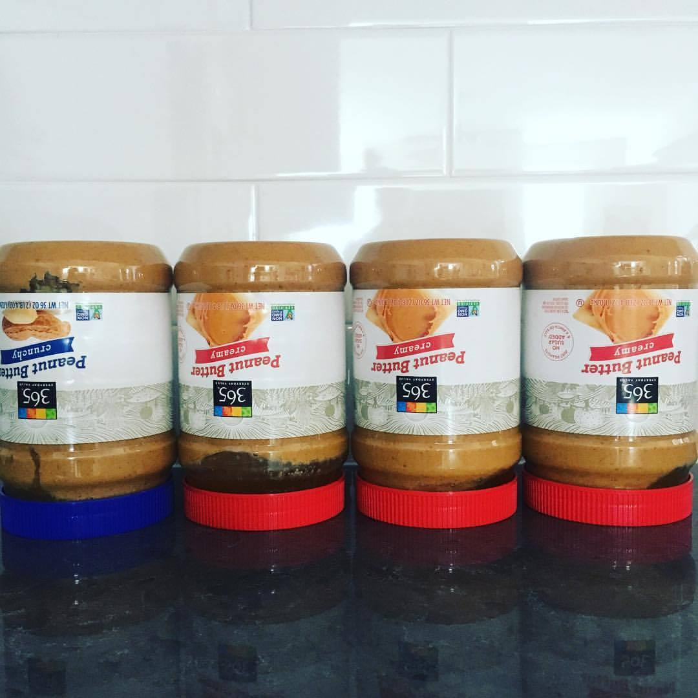
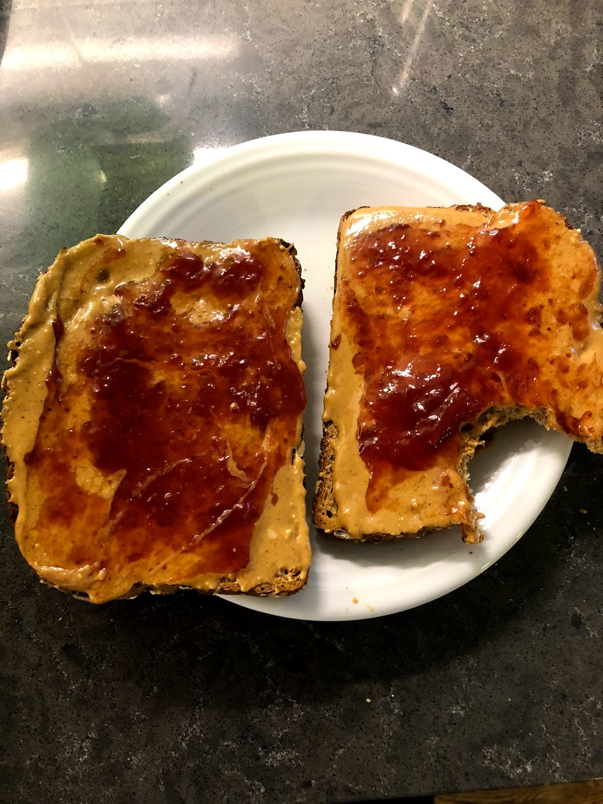

<!--more-->

Peanut butter is one of the most common foods found in almost every
household in America. If you've ever eaten a peanut butter and jelly
sandwich, you've probably wondered who came up with the idea to grind
peanuts into a paste and put it on bread.

The answer is a little complicated. Peanut butter has been around for
centuries, but it wasn't always the smooth, creamy spread we know today.
The earliest versions of peanut butter were more like a chunky paste,
and they were often used as a medicine or a food for people who couldn't
chew solid food, like old folks with no teeth.

The first person to patent a peanut butter-making machine was a man
named Marcellus Gilmore Edson of Montreal, Quebec, Canada. He filed his
patent in 1884, and his machine was designed to grind roasted peanuts
into a paste.

In 1895, Dr. John Harvey Kellogg (the creator of Kellogg's cereal)
patented a process for creating peanut butter from raw peanuts. He
marketed it as a nutritious protein substitute for people who could
hardly chew on solid food. He also invented corn flakes, but that's a
whole other weird story. In 1903, Dr. Ambrose Straub of St. Louis,
Missouri, patented a peanut-butter-making machine.

By the early 1900s, peanut butter was being manufactured and sold
commercially in the United States. In 1922, Joseph Rosefield invented a
process for making smooth peanut butter that could be spread easily on
bread. This process is still used today. Rosefield's company was later
bought by Procter & Gamble, the makers of Jif peanut butter.

Peanut butter is a versatile food that can be used in many different
ways. It's a good source of protein and fiber, and it's also low in
saturated fat. Peanut butter can be eaten on its own, or it can be used
as an ingredient in other foods, like peanut butter cookies, peanut
butter and jelly sandwiches, and peanut butter cups. Some people even
like to eat it with celery, like ants on a log.

It’s not just good for eating, though. Peanut butter can be used to
remove chewing gum from hair, loosen a stuck zipper, shine shoes, clean
leather, and remove ink stains. And if you put it on toast, it makes a
nutritious breakfast.

No matter how you eat it, peanut butter is a delicious and nutritious
food that's been enjoyed by people all over the world for centuries. So
next time you're enjoying a peanut butter and jelly sandwich, take a
moment to think about the long and interesting history of peanut butter.
It is by far my favorite food, because it is a great fuel for running +
cycling and it is simple + packable!

### Whole Foods 365 Natural Peanut Butter Review

Whole Foods 365 Natural Peanut Butter is a natural peanut butter made
with just two ingredients: peanuts and salt. It is free of hydrogenated
oils, sugar, and preservatives. It is a good source of protein, fiber,
and healthy fats. 365 Peanut Butter has a slightly different taste than
other peanut butters. It is less sweet and has a more intense peanut
flavor. I like that Whole Foods 365 is a more natural-tasting peanut
butter and tastes the most like plain peanuts compared to other brands.
It goes without saying, if you're looking for healthier alternatives to
Jif and Skippy, 365 is definitely worth giving a try.

Like most natural peanut butters, 365 Natural can be difficult to mix.
The oil separates from the solids and rises to the top of the jar. To
mix it, here is a popular and very effective method:

1.  Store the peanut butter upside down for a day or two. This will help
    the oil to distribute a bit.

2.  Open the jar and stir it with a knife or a spoon.

3.  If it is still too thick, add a little bit of water or milk and stir
    again.

4.  Keep stirring until the peanut butter is smooth and creamy.

It may take a few minutes to get the right consistency, but it's worth
the effort! If you ever have to do multiple jars at once, try just
stirring one jar with a power mixer (like a Kitchen-Aid standing mixer
with the mixer attachment), then once that jar is smooth, pour it into
the next jar and stir until it is smooth, and so on.

