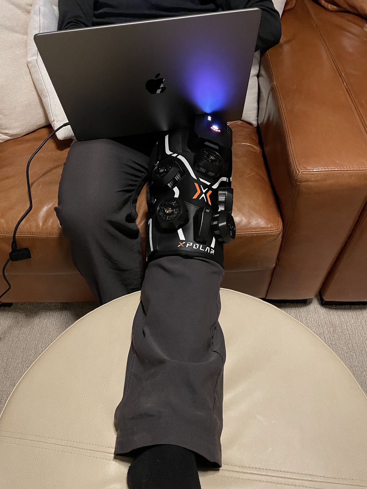

<!--more-->

*Article by John Tribbia*

Original Post from RoadTrailRun
([link](https://www.roadtrailrun.com/2025/11/xpolar-x2-knee-sports-recovery-device.html))

<a href="https://www.roadtrailrun.com"
class="button primary button-wrapper">Read All RoadTrailRun
Reviews Here</a>

[XPolar X2](https://www.amazon.com/stores/XPOLAR/page/6B6C9E60-8990-4992-A2DC-F90E651CA8C9?lp_asin=B0DLKQX9MN&store_ref=bl_ast_dp_brandLogo_sto&linkCode=sl2&tag=roadtr03-20&linkId=e51b03fdeedc98e7392449af0bd8ec5f&language=en_US&ref_=as_li_ss_tl)
(now $299.00 USD Regular price $369.00 USDSave $70.00)

### 

John: As a trail runner, my sanity is intrinsically linked to my ability to get out on the trail. So when a recent unexpected flare-up of a knee issue arose over the summer before my planned race at the Rattlesnake Ramble, I was devastated. My routine devolved into a frustrating cycle: run, swell, ice, hobble, and repeat. My freezer was a chaotic mess of gel packs, and the monotony of holding a bag of frozen peas on my knee multiple times a day was wearing thin.

For the past few weeks, I’ve been testing the Xpolar X2 as a recovery tool for a knee that is both acutely injured with swelling and pain, and chronically angry with stiffness and a deep ache. This device is far more than just another massager - it's a 4-in-1 recovery system offering Cold, Heat, Contrast, and Compression therapies.

The device itself is a substantial, ergonomic brace, not a flimsy sleeve. You strap yourself into it with a series of very strong Velcro straps.
My knee presents a dual challenge: post-run, it swells, and in the mornings, it can be stiff and achy, resisting movement. I utilized the X2's various functions to address both issues. The “Cold + Compression” feature is its standout capability. After a trail run, I would get back to my house, strap on the X2, and hit the “Cold” button. The device quickly reaches a legitimate 32°F, providing a true ice-on-skin sensation. This is combined with a 4-airbag system that delivers dynamic, pulsing compression. The combination is effective at pushing swelling out of the joint, offering a much deeper treatment than a surface-level ice pack. After just a 15-minute session, the swelling was visibly reduced, and the sharp pain had subsided.
On rest days or first thing in the morning when my knee felt like a rusty hinge, the “Heat + Compression” mode was my go-to. The device heats up to a deep, therapeutic 122°F. This warmth, paired with gentle compression, worked wonders on my joint stiffness, significantly improving my mobility and reducing that deep, bony ache. For ongoing recovery needs, I used the Contrast mode, which automates the process of alternating between hot and cold cycles. Lying on the couch while the X2 switched between icy cold and deep heat, all while pulsing with compression, adds to a nice recovery effort.

The battery-powered, portable design is a luxury I didn't know I would enjoy, allowing me to start my recovery anywhere. I consistently get 3-4 full 15-minute cold sessions on a single charge, and the fast charger gets it back to full power in under two hours. While there's an app for deep customization, I found the on-device buttons to be simple and effective.

Verdict / Who is this for?
If you are a runner who is constantly battling injuries and desperate to stay on the trail, this device effectively bridges the gap between basic home recovery methods like ice packs and professional physical therapy. While it is a steep investment, for those who are sidelined by pain and inflammation, the ability to consistently and effectively manage those issues is great.

### AMAZON

### XPolar
