<!--more-->

*Article by John Tribbia*

Original Post from RoadTrailRun
([link](https://www.roadtrailrun.com/2026/01/roadtrailride-zwift-ride-with-kickr.html))

<a href="https://www.roadtrailrun.com"
class="button primary button-wrapper">Read All RoadTrailRun
Reviews Here</a>

---

## Introduction

I’ve been on a journey this year to diversify my training options, given the need to minimize all of the pounding my legs have endured in the past 20 years.
The [Zwift Ride with KICKR Core 2](https://us.zwift.com/collections/equipment/products/zwift-ride-kickr-core-2?variant=46913668382976) is a complete indoor cycling solution that Zwift bills as “the ultimate smart bike for Zwifters” and their first foray into integrated hardware. At $1,299.99, it's their attempt to deliver a premium virtual cycling experience without the eye-watering price tag of high-end smart bikes like the Wahoo KICKR Bike Pro ($3,999) or Tacx NEO Bike Plus ($3,999).
I'll be honest - I didn't expect to like this as much as I do. But after a couple of weeks of testing, it's become a genuinely valuable tool in my cross-training set up. Not a replacement for outdoor running - nothing is - but a smart option for keeping fitness intact when my body needs a break from pounding the downhills.

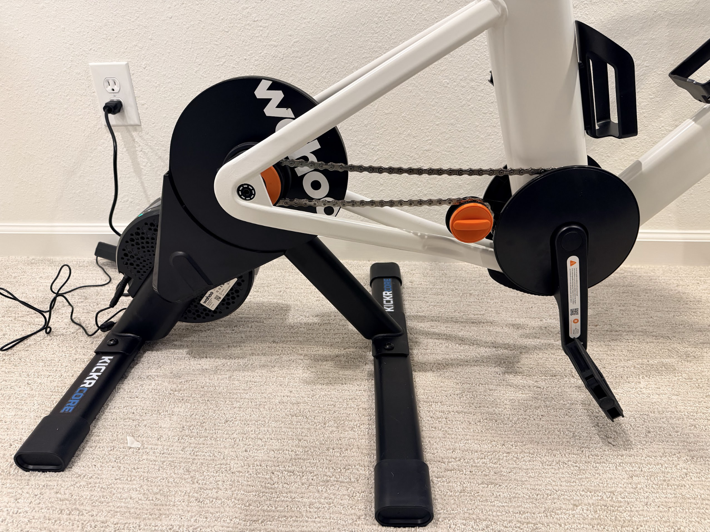

The Zwift Ride is essentially a purpose-built frame bike paired with Wahoo’s proven KICKR Core 2 smart trainer. Zwift says the setup “combines the immersive experience of a smart bike with the flexibility and value of a smart trainer.” It’s designed for people who want a dedicated indoor cycling setup without the hassle of constantly mounting and unmounting an outdoor bike. This is certainly the appeal for me, especially given its relatively compact size.

The package included:
- The Zwift Ride frame (non-motorized bike with adjustable fit)
- Wahoo KICKR Core 2 trainer (the actual resistance unit)
- Zwift Click (wireless shift controller)
- Zwift Play controllers (handlebar-mounted game controllers)

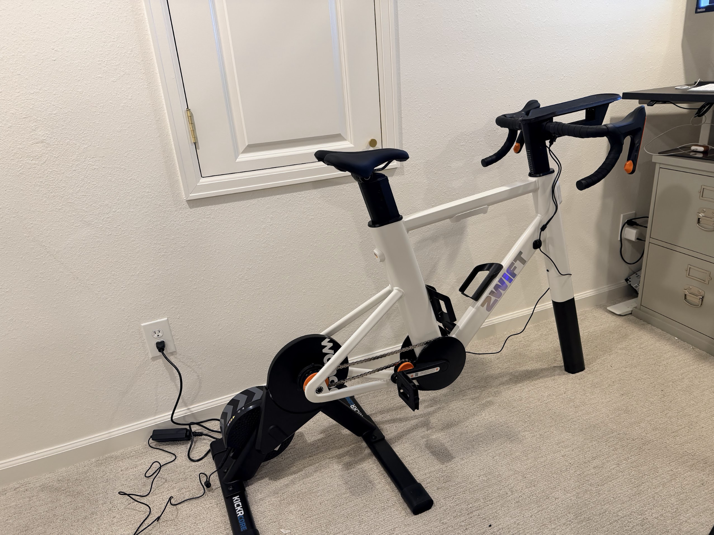

The KICKR Core 2 delivers up to 2,000 watts of resistance and simulates gradients up to 20%, while maintaining what Wahoo claims is ±2% power accuracy. The Cog is a single-speed cassette that works with the Click controller to simulate a full drivetrain virtually - no derailleurs, no cables, no traditional shifting.
It’s a nice concept, and for runners looking for serious cross-training that doesn’t beat up their joints, it’s worth considering.

### Pros:

- Smooth, quiet, realistic ride feel
- Seamless Zwift integration and gamification makes time pass
- Quality construction, stable during hard efforts
- Thoughtful details (water bottle holders, cable management)
- Reasonable price for what you get

### Cons:

- Limited fit adjustability for shorter/taller riders
- Heavy (though stable)
- Requires Zwift membership ($199.99/yr) for full functionality
- Still indoor training (not a replacement for getting outside)

## Unboxing and Set Up

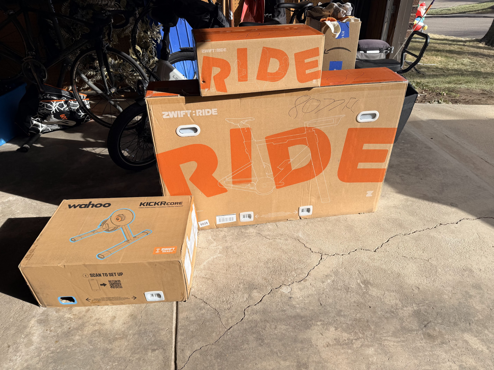

The Zwift Ride arrives in three substantial boxes - one for the bike frame, one for the KICKR Core 2, and the third for the smart handlebars. I will give a fair warning that this thing is kind of heavy. Not immobile - I could shift the assembled unit around my basement training space - but it takes some effort and I wouldn’t plan on lugging it up and down stairs
Setup took me about 45 minutes, which included some head-scratching over the instructions for calibrating the connection from the KICKR Core 2 to the app and my computer. Once assembled and connected, though, the unit feels rock-solid.
The basic steps include:
1. Assemble the bike frame (seat post, handlebars, pedals)
2. Attach the KICKR Core 2 to the frame's rear mount
3. Pair everything via Bluetooth to your device
4. Dial in your fit

That last step - dialing in the fit - is where things got most challenging for me.

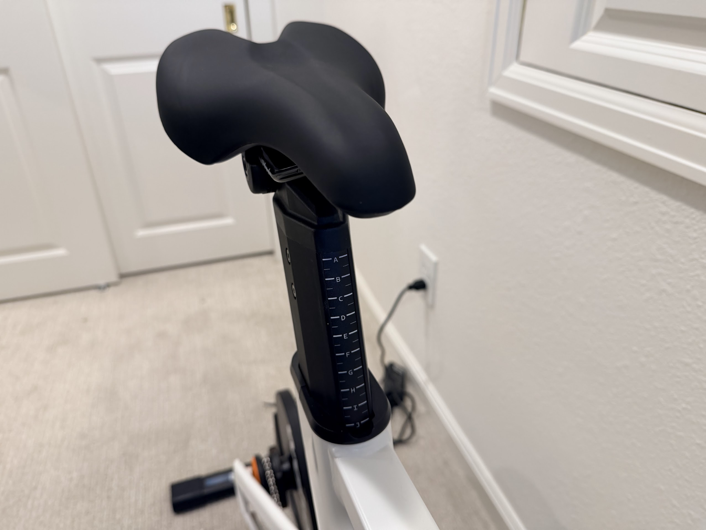

At 5'6" with a proportionally short torso, I immediately hit the limits of the Zwift Ride’s adjustment range. To get a comfortable position, I needed the seat all the way forward and the handlebars pulled all the way back. I got there and it fits quite well for my specific needs, but the micro-adjustments that would let me fine-tune my position simply were somewhat clunky. I will note that I have a preference for being more upright than aggressive, so my reach is typically shorter than most.
Zwift claims the bike fits riders from 5'0" to 6'5" (152cm to 196cm), and I believe that’s technically accurate. But if you’re on either extreme of that range, expect to max out the adjustment sliders. For most people in the middle of that height spectrum, this likely won’t be an issue.
So, if you're particularly short or particularly tall, consider whether this frame will truly accommodate your proportions before buying. A proper bike fit matters for comfort, especially during those longer cross-training sessions when your knee needs the break but you're still putting in serious time.

## The Ride

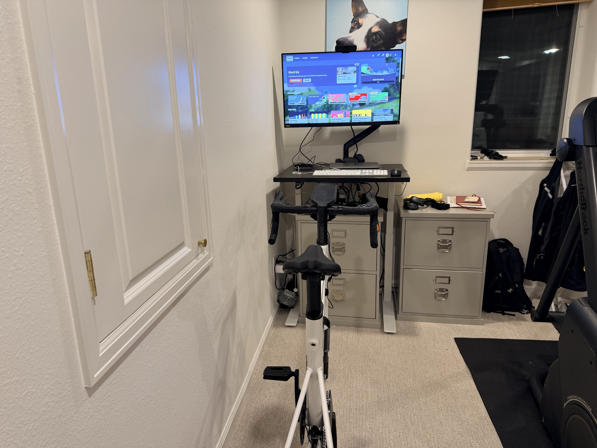

I’m definitely not a huge fan of indoor cycling. I raced bikes as a junior and have always kept my bikes close for supplemental training or when I’m injured. I also primarily commute by bike, and I don’t have much that prevents me from getting out on two wheels other than severe winds and ice. So, I’m someone who would rather run outside in single-digit temperatures or ride in the dark because I’d rather deal with frozen eyelashes or not being able to see the scenery than be inside. The idea of pedaling in my basement while staring at a screen sounded less than ideal.
But once positioned and paired, I fired up Zwift and clicked into my first ride, and it wasn't terrible. Actually, it was kind of engaging.

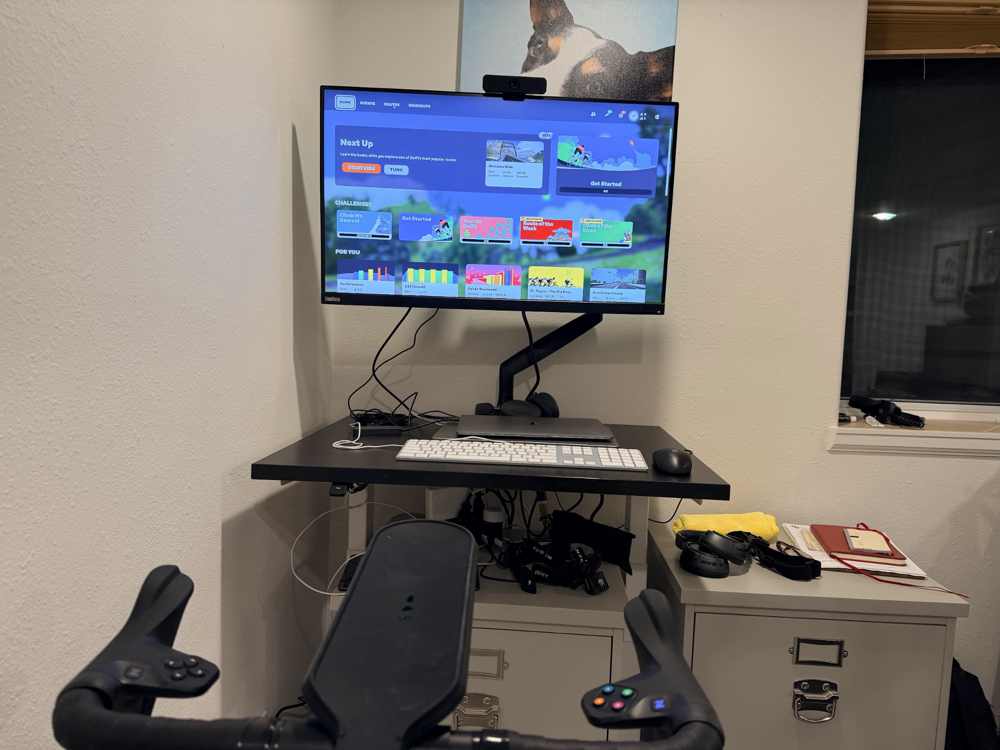

The pedal stroke feels smooth and natural. The KICKR Core 2 is much quieter than I expected. I could easily have a conversation or listen to a podcast at moderate effort. At high intensities when I was really pushing the pedals, there's some mechanical noise, but nothing like the pounding reverb of a treadmill.
The resistance response is nearly instantaneous. When Zwift's virtual terrain pitched upward, the trainer responded within a second. The gradient simulation feels genuinely realistic - at 8-10% grades, I was grinding hard, just like running up a mountain trail minus the impact.

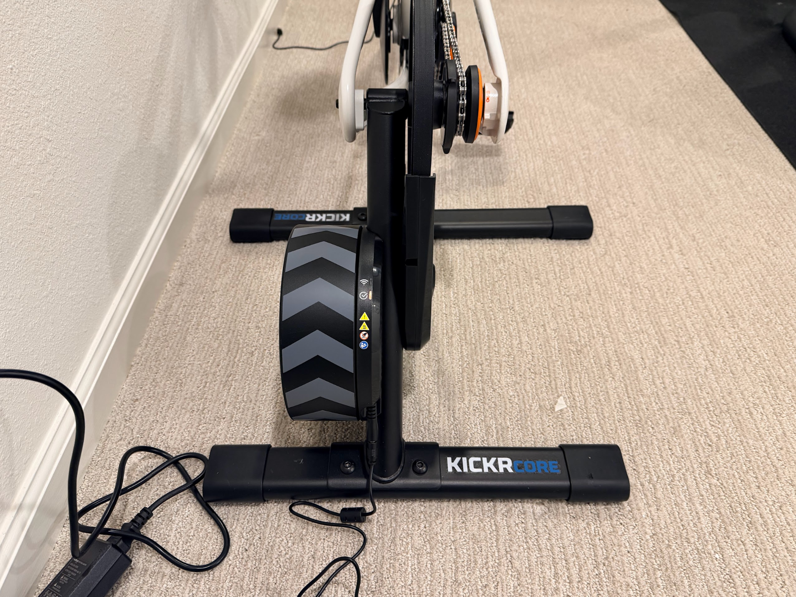

The Click controller handles all shifting, and it works really well, but it is a bit tricky to remember what button does what. The tactile buttons are easy to find without looking. I initially thought I'd miss traditional shifting, but within a few rides, it got easier and is now completely natural.

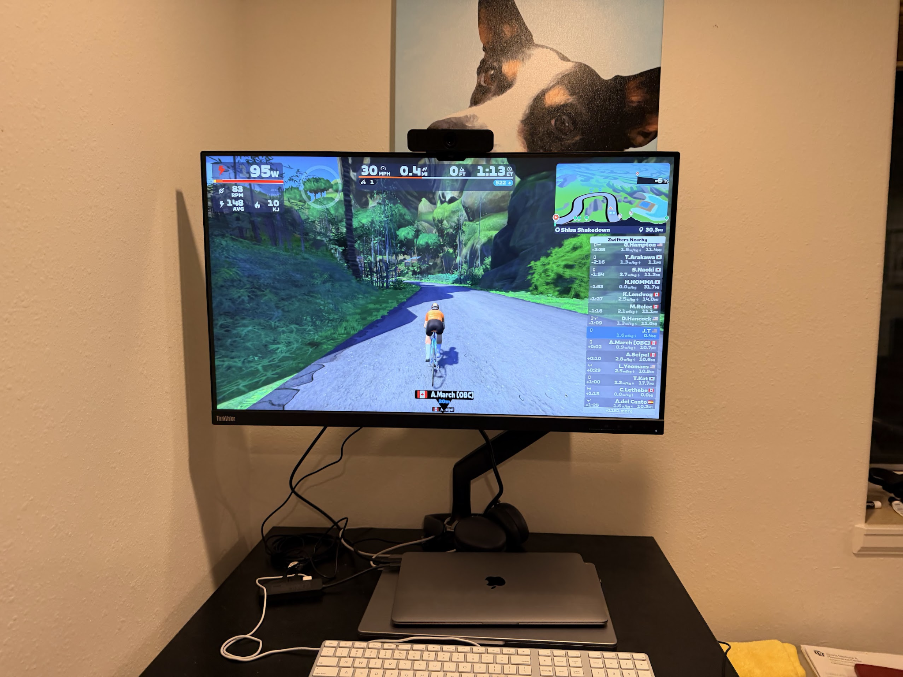

The Zwift Play controllers add game-like interactivity - steering around other riders, triggering PowerUps, navigating junctions. The gamification - levels, achievements, virtual bike unlocks, route badges - provides compelling reasons to keep coming back. It's still not outside, but it's engaging enough to make the time pass, which is saying something for someone who usually can't stand indoor workouts.

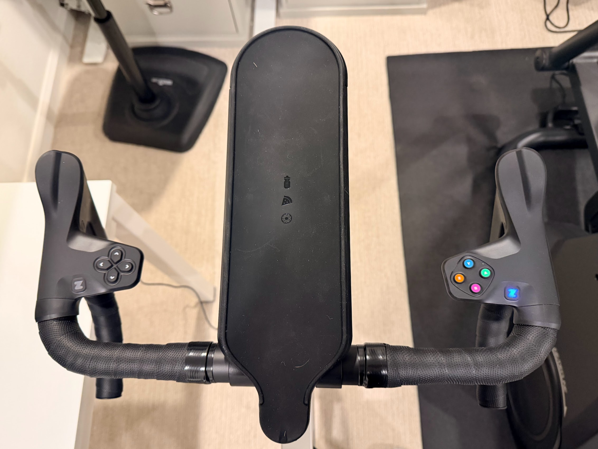

## Other features

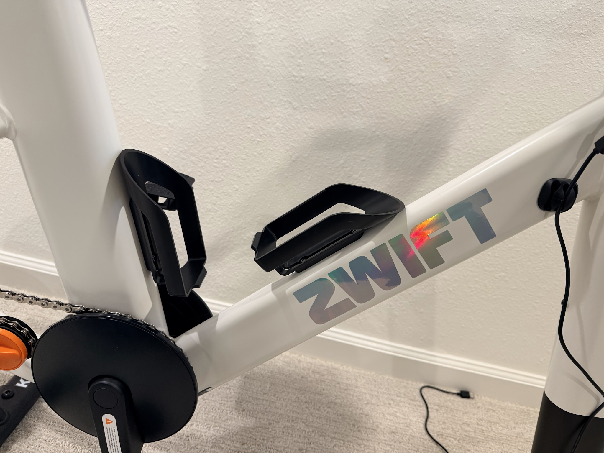

The integrated water bottle holders are positioned right where you'd expect them on a road bike - easily accessible mid-ride. After testing treadmills where water bottle placement is an afterthought (or nonexistent), this attention to detail is refreshing. I could grab a drink during interval recoveries without breaking rhythm. Small thing, big difference over a long cross-training session.
The Zwift Ride feels substantial and well-constructed. The frame is steel (hence the weight), with clean welds and a no-nonsense industrial design.

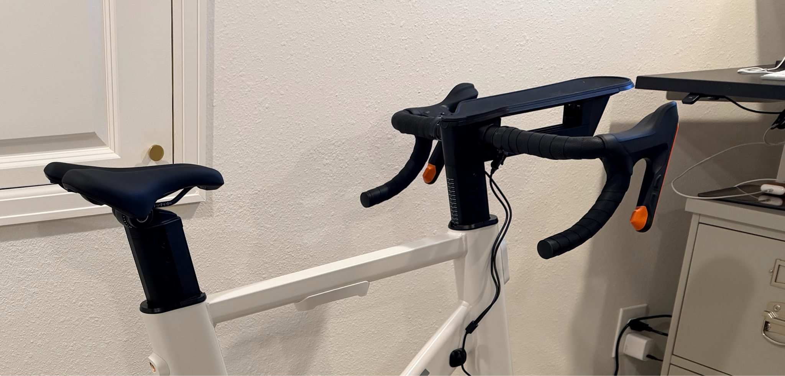

During hard efforts - standing climbs, sprint intervals - there was zero flex or wobble. The KICKR Core 2's connection to the frame is rock-solid. The whole assembly stays planted even when I was hammering on intervals. My only durability question mark is long-term wear on the Cog. It's a single cog getting hammered constantly. Time will tell, and replacement cogs are available if needed.

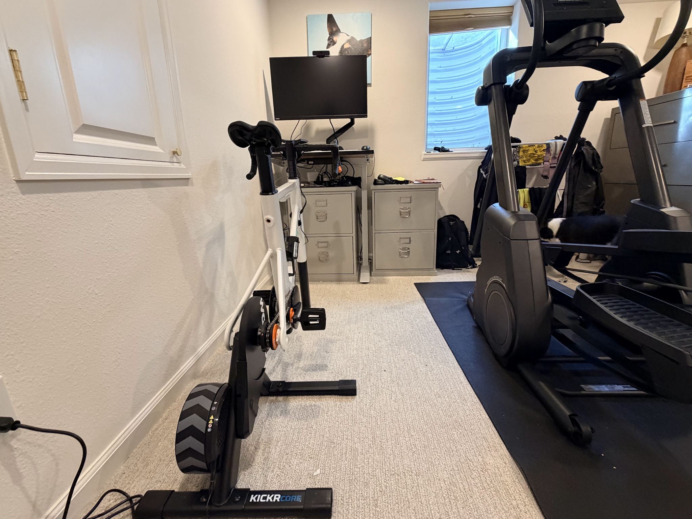

The footprint is roughly 4 feet long by 2 feet wide - manageable for a basement, spare room, or garage setup. It's definitely smaller than setting up your outdoor bike on a traditional trainer with a separate desk for devices. The integrated tablet mount keeps everything tidy.
That said, you're still dedicating floor space to this equipment. It's not something you'll be tucking in a closet between rides.

## Value Proposition: Worth It for Serious Cross-Training?

At $1,299.99, the Zwift Ride with KICKR Core 2 isn't cheap. If you were to buy the components separately, you'd be at approximately $1,400-1,500 before even considering a compatible bike frame. So the bundled pricing is actually reasonable.
Compare this to:
Wahoo KICKR Bike: $3,499
Tacx NEO Bike: $3,199
Basic trainer + road bike: $500-800+
Nothing (skipping workouts when hurt): $0 but fitness lost

## Conclusion

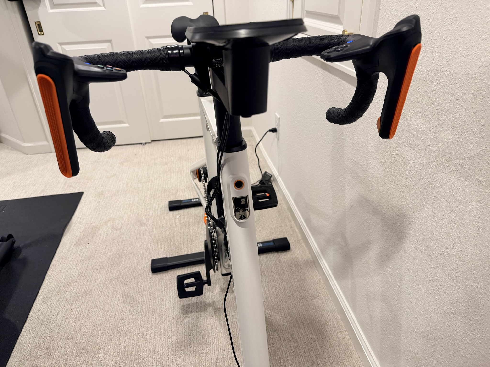

The Zwift Ride with KICKR Core 2 offers a high-quality indoor cycling experience that, while not replacing outdoor running, proves to be a genuinely valuable tool for runners. It excels as a cross-training option, making it a solid investment for maintaining and even building fitness, especially during injury recovery or demanding training cycles when the body needs a break from the high-impact.
The cycling setup’s low-impact nature is perfect for active recovery days when legs are too fatigued for another run. With variable resistance, the user can precisely control the intensity, transitioning from easy, restorative spins to challenging efforts. I love that the engaging platform of Zwift transforms indoor cross-training from a chore to an activity I can actually commit to.
While I’m dedicated to getting outside as much as possible, the Zwift Ride with KICKR Core has become a great alternative for days when I need a break.

### Who should buy it:

Runners who need regular low-impact cross-training options
People training through winter who want an alternative to outdoor running
Anyone who values maintaining fitness during injury recovery
Cross-training enthusiasts who take their cycling workouts seriously

### Who should skip it:

Casual exercisers who won’t use it enough to justify the cost
People who already have a bike and trainer they’re happy with
Athletes on the extreme ends of the height spectrum